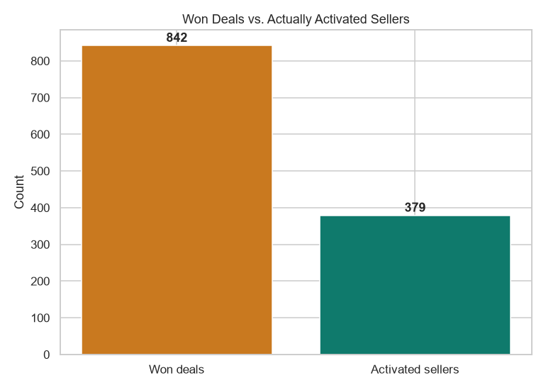
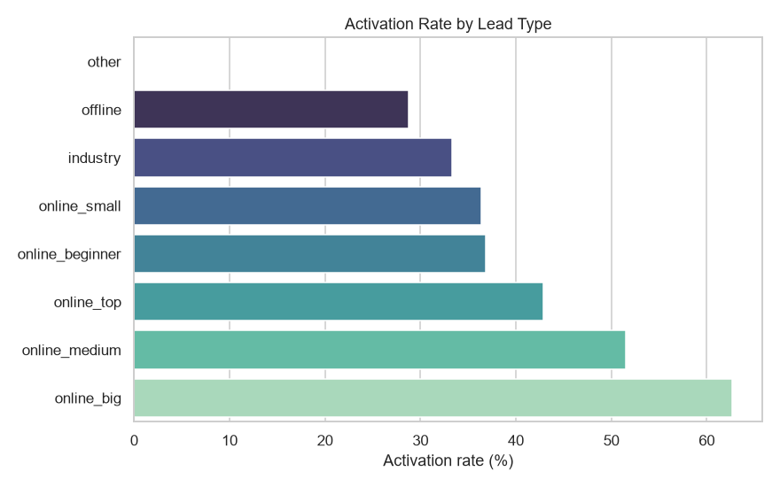
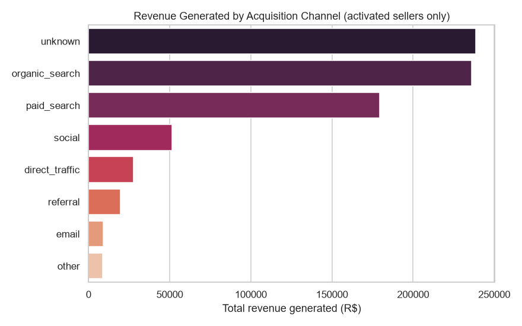

# Case Study: The Funnel Doesn't End at "Won" — It Ends at "Activated"

**A merchant-acquisition funnel analysis for a WhatsApp-first SMB platform, built on 8,842 real marketing leads and deals (2017–2018).**

---

## The business question

Most acquisition dashboards stop at the sale: a lead came in, a deal was won, ship the confetti. But for a platform whose revenue depends on merchants actually *using* it — listing products, taking orders, generating GMV — a signed deal is not the finish line. It's a bet that the merchant will activate. This analysis asks the question acquisition dashboards usually skip: **of the merchants we win, how many actually go on to generate revenue — and is the acquisition team optimizing for the wrong stage of the funnel?**

To answer that with real data, this project uses the [Olist Marketing Funnel dataset](https://www.kaggle.com/datasets/olistbr/marketing-funnel-olist) (CC BY-NC-SA 4.0) — a real record of 8,000 marketing-qualified leads and 842 closed deals for Olist's seller-acquisition funnel — joined to real seller order/revenue data from the companion [order-operations project](https://github.com/achi-vyshnavi28/whatsapp-order-ops-analytics). This is structurally the same problem a WhatsApp-first SMB platform faces: sales/marketing signs up merchants, but the platform's actual growth depends on what happens *after* the signature.

## Data & method

- **PostgreSQL** for the source of truth: a 4-table relational schema (leads, closed deals, sellers, seller revenue) queried with joins, CTEs, window functions and subqueries ([`sql/`](../sql)) — including a deliberate design choice to leave `closed_deals.seller_id` un-constrained by a foreign key, because the gap it reveals *is* the finding (see below).
- **Python** (Pandas, NumPy, Matplotlib/Seaborn, SciPy, scikit-learn) for cleaning, exploratory analysis, statistical testing (chi-square test of independence), and a logistic regression model that predicts activation at the moment a deal closes ([`python/eda_analysis.py`](../python/eda_analysis.py)).
- **Excel** for turning the activation gap into a financial opportunity model a revenue-ops stakeholder can adjust live ([`excel/funnel_financial_model.xlsx`](../excel/funnel_financial_model.xlsx)).
- **Power BI** for a live, explorable version of the same story, connected directly to the database ([`dashboard/funnel_activation_dashboard.pbix`](../dashboard/funnel_activation_dashboard.pbix)).
- **Streamlit** for a public, interactive version of this dashboard, including a live activation-opportunity what-if calculator: **[smb-merchant-funnel-analytics-5ey63g5wxmxidc6v3sj3kg.streamlit.app](https://smb-merchant-funnel-analytics-5ey63g5wxmxidc6v3sj3kg.streamlit.app)**.

Every number below comes from a query or script in this repo — none of it is asserted without a source.

## Finding 1 — More than half of "won" deals never activate

Of 8,000 marketing-qualified leads, 842 (10.53%) convert to a won deal. Of those 842 won deals, only **380 (45.13%) ever go on to list a product or make a sale.** In other words: **54.87% of signed merchants — 462 of them — are a complete acquisition write-off.** The deal closed, the CRM says "won," and nothing happened next.

**Why it matters:** if the sales team is measured on deals won, they're optimizing for a number that's only half-correlated with actual business value. Win-rate is the wrong north-star metric for this funnel; activation-rate is.

## Finding 2 — Activation isn't random: it's predictable by lead type

Activation rate by lead type ranges from **28.8%** (`offline`) to **62.7%** (`online_big`) — more than a 2x gap. A chi-square test of independence confirms this isn't noise: **χ² = 45.69, dof = 7, p < 0.001.** Activation is statistically dependent on how the lead was acquired.

**Why it matters:** this turns "improve activation" from a vague operations goal into a targeting decision. Acquisition spend chasing `offline` leads is chasing the segment least likely to ever generate revenue — `online_big` and `online_medium` leads are worth a materially higher cost-per-acquisition because they convert to real revenue at 1.5–2x the rate.

## Finding 3 — Paid acquisition isn't obviously paying off

Among activated sellers, `organic_search` (112 sellers, R$235,919 total revenue) and `unknown`-origin leads (81 sellers, R$238,479) generate more total revenue than `paid_search` (101 sellers, R$179,427) — despite paid search requiring the most acquisition spend. `social` converts the least efficiently of any major channel: reasonable lead volume, but the lowest revenue-per-activated-seller among all channels with 5+ sellers.

**Why it matters:** paid acquisition budget is currently not aligned with where activated revenue actually comes from. This is a direct input into a acquisition-budget-reallocation conversation.

## Finding 4 — Activation can be predicted the moment a deal closes

A logistic regression trained on features known at the moment of signing (lead type, business segment, whether the merchant has a registered company/GTIN, declared catalog size) predicts whether a won deal will actually activate with **58.8% accuracy and ROC-AUC = 0.645** on held-out deals — well above the 50% coin-flip baseline for a problem this noisy.

**Why it matters:** this moves the org from a purely retrospective report ("380 activated last quarter") to an operational tool: flag low-probability-of-activation merchants for extra onboarding support *the day they sign*, instead of finding out three months later that they never activated.

## Quantifying the impact: what is the activation gap actually worth?

Rather than stop at "activation is low," the [Excel model](../excel/funnel_financial_model.xlsx) turns Finding 1 into a dollar figure using a transparent, adjustable formula:

> additional revenue = (sellers needed to close the gap to a target activation rate) × (avg revenue per activated seller)

With the platform's actual numbers (842 won deals, 380 activated, current activation rate 45.01%, avg revenue per activated seller ≈ R$2,038):

| Metric | Value |
|---|---|
| Current activation rate | **45.01%** |
| Target activation rate (adjustable input) | **60%** |
| Additional sellers activated to hit target | **126** |
| Additional revenue from closing the gap | **≈ R$256,925** |

This isn't hardcoded — it's a live formula. Move the yellow target-rate cell to 100% to see the full size of the won-but-never-activated opportunity, or dial it down to model a more conservative onboarding-investment case.

## Anomaly worth flagging: self-reported revenue at sign-up is unreliable

Two sellers declared R$50,000,000 and R$8,000,000 in expected monthly revenue at onboarding and generated **zero** actual revenue (full list of 14 outliers in [`reports/eda_report.md`](../reports/eda_report.md)). Declared figures are currently unverified and unbounded in the sign-up flow — a simple sanity cap would catch this class of noise (or fraud-adjacent optimism) before it pollutes revenue forecasts built on self-reported data.

## Recommendations

1. **Replace "deals won" with "activation rate" as the primary funnel KPI** — a metric that stops rewarding signatures that never turn into revenue.
2. **Reallocate acquisition spend toward `online_big`/`online_medium` lead types** (SQL Q5 in [`sql/02_analysis_queries.sql`](../sql/02_analysis_queries.sql) ranks all lead types by activation rate) and away from `offline`, which activates at less than half the rate.
3. **Audit paid-search spend against activated revenue, not deals won** — `organic_search` currently outperforms it on revenue generated per acquired seller.
4. **Operationalize the activation-prediction model** as a day-one onboarding flag: route low-predicted-activation merchants to a higher-touch onboarding flow instead of discovering the failure retrospectively.
5. **Cap or verify declared revenue at sign-up** to keep self-reported onboarding data usable for forecasting.

## Tools & skills demonstrated

SQL (PostgreSQL: joins, CTEs, window functions, subqueries, intentional data-quality-driven schema design) · Python (Pandas, NumPy, Matplotlib, Seaborn, SciPy, scikit-learn) · Statistical testing (chi-square test of independence) · Predictive modeling (logistic regression, ROC-AUC evaluation) · Excel (live formulas, what-if modeling) · Power BI (DAX measures, relationships across 4 tables, live database connection) · Data-quality auditing (documented, not silently patched)

Full technical report with all cleaning notes and additional cuts: [`reports/eda_report.md`](../reports/eda_report.md)
